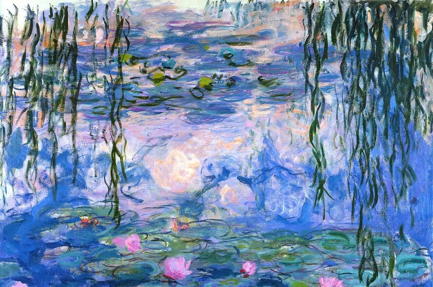
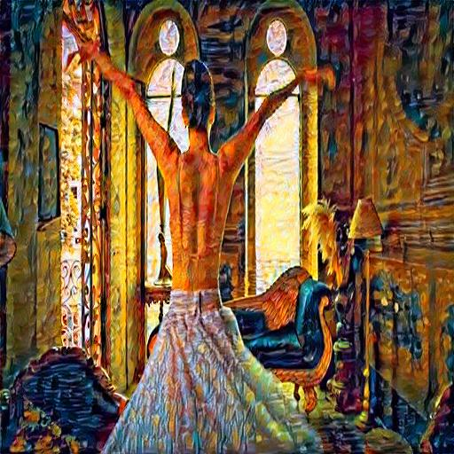
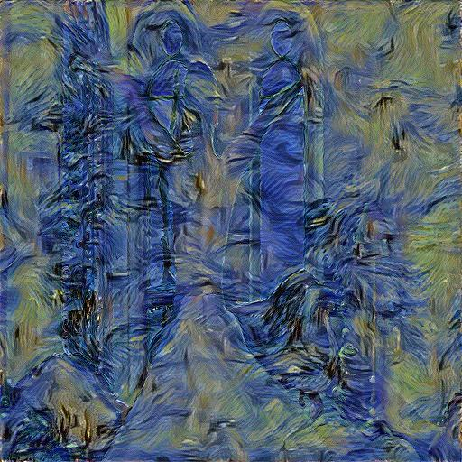
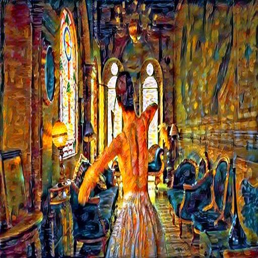
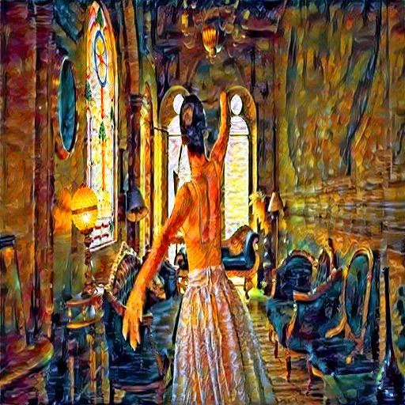
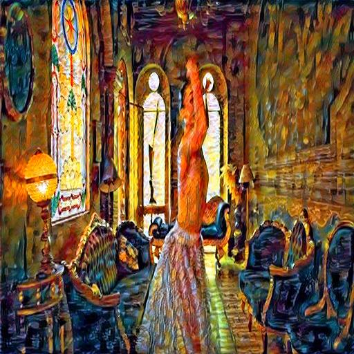

# Fairytale - Neural Style Transfer on Video Frames 

This project explores the application of Neural Style Transfer (NST) to videos by applying the technique frame by frame. The goal is to transform a video into a moving painting by preserving the original content of the video while transferring the artistic style of a famous painting.

---

## Paintings

Below are four of the famous paintings used as style references during experimentation:

| Style Image 1 | Style Image 2 | Style Image 3 | Style Image 4 |
|---------------|---------------|---------------|---------------|
|  |  |  |  |

---

## Samples output 

 

after applying the 4 styles on we have new amazing painted images shown below

| Image 1 |  Image 2 |  Image 3 |  Image 4 |
|---------------|---------------|---------------|---------------|
|  |  |  |  |

## Stylized Output Frames

Each of the 26 frames was stylized using the selected style image. Below is a preview grid of the stylized frames(some of them):

| Frame 0 | Frame 1 | Frame 2 | Frame 3 |
|--------|--------|--------|--------|
|  |  |  |  |

| Frame 4 | Frame 5 | Frame 6 | Frame 7 |
|--------|--------|--------|--------|
|  |  |  |  |

---

## Final output

After processing the frames, the stylized images were combined back into a video:

**Output video preview:**  
  

---

