# Fairytale Project: The Journey Through Three Generative Art Versions

This repository is the evolution of the **Fairytale Project**, showcasing three different approaches to artistic video and image generation:

1. **v1: Neural Style Transfer on Video Frames**
2. **v2: CycleGAN Style Transfer on Video Frames**
3. **v3: DeepVAE + Attention GAN for Islamic Art Generation**

Each version is presented in its own folder (`v1/`, `v2/`, `v3/`) with code, samples, and outputs.

---

## Table of Contents

* [v1: Neural Style Transfer](#v1-neural-style-transfer)
* [v2: CycleGAN Style Transfer](#v2-cyclegan-style-transfer)
* [v3: DeepVAE + Attention GAN](#v3-deepvae--attention-gan)
* [Dependencies](#dependencies)
* [Future Work](#future-work)

---

## v1: Neural Style Transfer

**Goal:** Apply classic Neural Style Transfer (NST) frame by frame to video, turning it into a moving painting.

**Key Points:**

* Uses pre-trained style transfer networks.
* Each video frame is stylized individually.
* Output frames are combined back into video.

**Folder:** `v1/`

**Style References:**

| Style Image 1                                    | Style Image 2                                | Style Image 3                            | Style Image 4                               |
| ------------------------------------------------ | -------------------------------------------- | ---------------------------------------- | ------------------------------------------- |
| 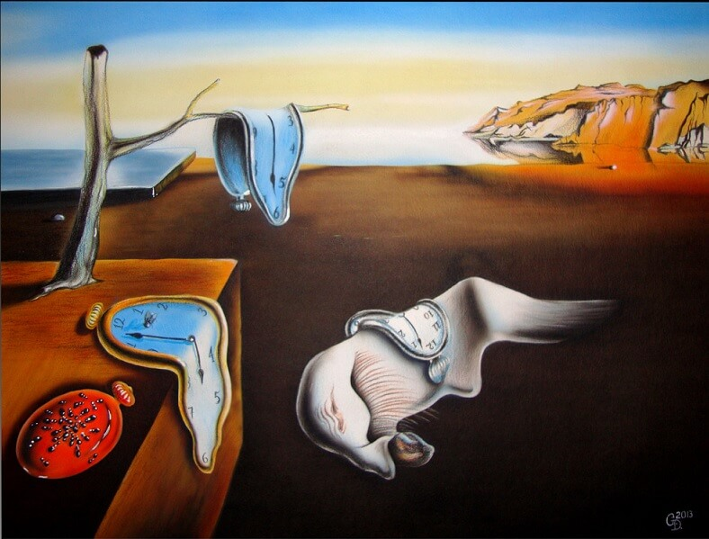 | 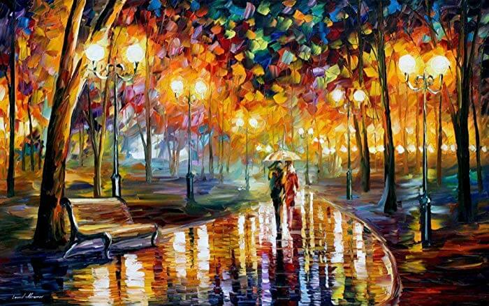 | 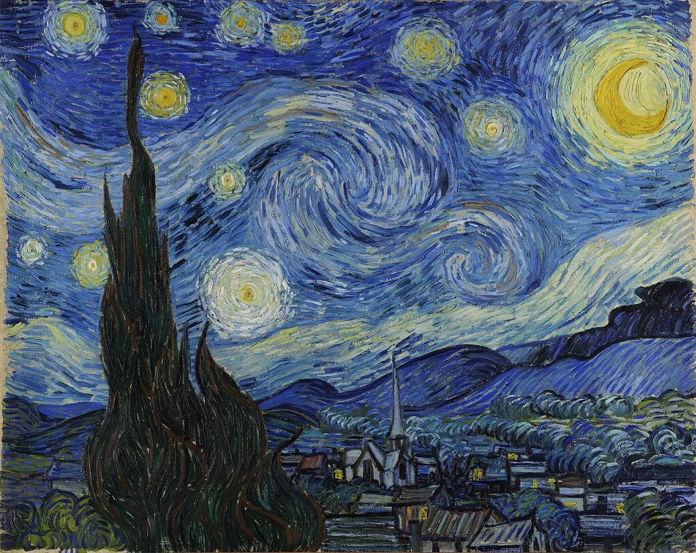 | 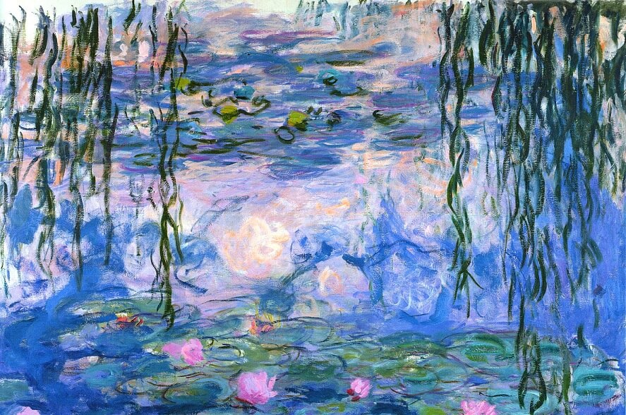 |

**Example Outputs:**

| Frame 0                                           | Frame 1                                           | Frame 2                                           | Frame 3                                           |
| ------------------------------------------------- | ------------------------------------------------- | ------------------------------------------------- | ------------------------------------------------- |
| 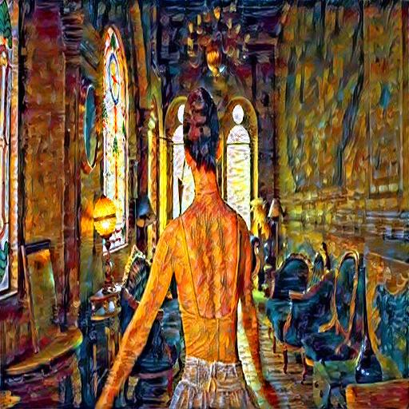 | 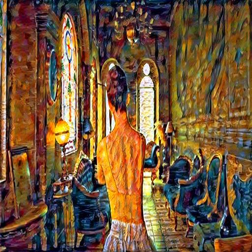 | 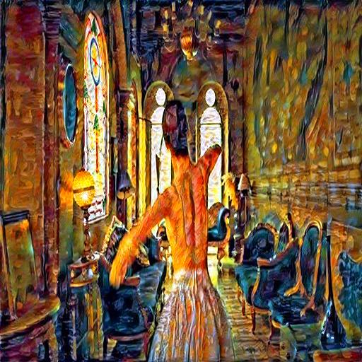 | 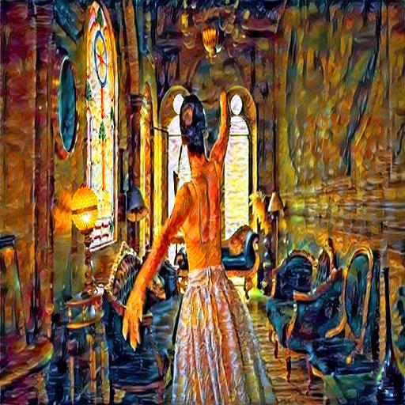 |

**Final Video Output:**


---

## v2: CycleGAN Style Transfer

**Goal:** Transform video frames into artistic paintings using **unpaired CycleGAN**, producing stable results across frames.

**Key Points:**

* Uses **two generators and two discriminators** with cycle consistency.
* Works on **unpaired datasets**, making it more flexible than NST.
* Output frames are temporally consistent and combined into video.

**Folder:** `v2/`

**Training & Results:**

| Epoch 50                                            | Epoch 200                                              | Epoch 500                                              |
| --------------------------------------------------- | ------------------------------------------------------ | ------------------------------------------------------ |
| 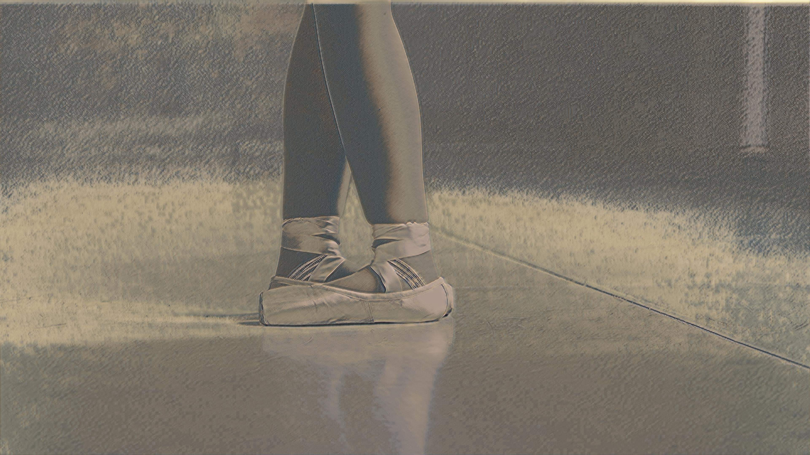 |  | 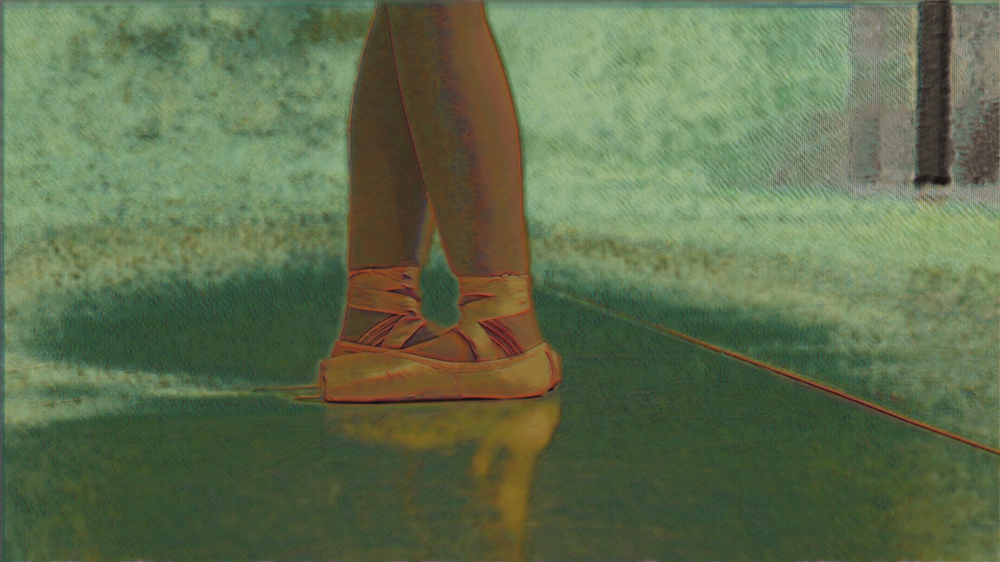 |

**Animated Results (GIFs):**

| Epoch 50                    | Epoch 200                     | Epoch 500                     |
| --------------------------- | ----------------------------- | ----------------------------- |
| 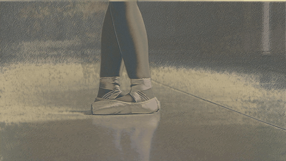 | 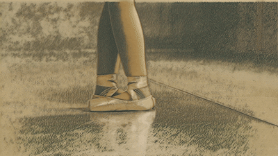 | 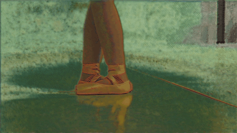 |

---

## v3: DeepVAE + Attention GAN

**Goal:** Generate high-quality Islamic art images using a **Deep Convolutional Variational Autoencoder** combined with a **Self-Attention GAN**.

**Folder:** `v3/`

### Model Overview

1. **DeepVAE**

   * Encoder compresses 128×128 images → latent vector (256-dim).
   * Decoder reconstructs images with transposed convolutions.
   * Uses **reparameterization trick** for sampling.

2. **Attention Generator**

   * Refines VAE output with **self-attention**.
   * Captures global patterns, crucial for Islamic geometric designs.

3. **Patch Discriminator**

   * Enforces local realism (PatchGAN).
   * Uses self-attention to capture long-range dependencies.

### Loss Functions

**VAE Loss:**

```math
\text{VAE Loss} = \text{MSE} + 0.1 \times \text{Perceptual Loss} + 1e^{-4} \times \text{KL Divergence}
```

**GAN Hinge Loss:**

* Discriminator:

```math
\text{Loss}_D = \text{mean}(\text{relu}(1-D_\text{real})) + \text{mean}(\text{relu}(1+D_\text{fake}))
```

* Generator:

```math
\text{Loss}_G = -\text{mean}(D_\text{fake})
```

### Example Outputs

| Sample 1                      | Sample 2                      | Sample 3                              | 
| ----------------------------- | ----------------------------- | ------------------------------------- | 
|  |  |  |

**Observation:**

* Early epochs: blurry outputs.
* Later epochs: sharp, detailed patterns.
* Self-attention captures long-range geometric dependencies.

---

## Dependencies

* Python 3.8+
* PyTorch 2.x
* torchvision
* datasets (Hugging Face)
* tqdm
* PIL

---

## Future Work / Improvements

* Multi-scale discriminators for higher-resolution outputs.
* Mixed-precision (AMP) training for speed and efficiency.
* Latent space interpolation for smooth art morphing.
* Conditional generation (color palette, motif type).

> Note: v3 outputs are still somewhat weak in texture and fine detail. The next design will improve this.

---

## References

* [Islamic Art Dataset](https://huggingface.co/datasets/adhamelarabawy/islamic_art)
* [Self-Attention GAN (SAGAN)](https://arxiv.org/abs/1805.08318)
* [Variational Autoencoder (VAE)](https://arxiv.org/abs/1312.6114)
* [CycleGAN](https://arxiv.org/abs/1703.10593)
* [Neural Style Transfer](https://arxiv.org/abs/1508.06576)

```
```
