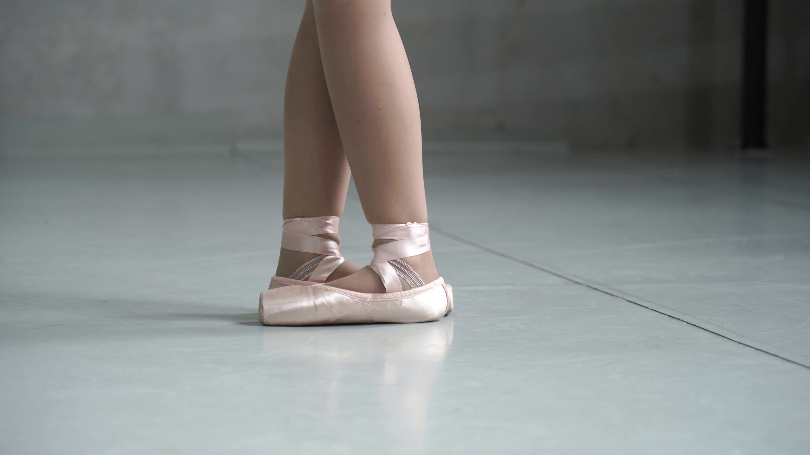

# **Fairytale 2.0 — CycleGAN Style Transfer on Video Frames**

This project applies **CycleGAN** to transform video frames into **moving artworks**. Unlike classic Neural Style Transfer (NST), which is slow and requires paired data, **CycleGAN** learns an **unpaired mapping** between real video frames and paintings, enabling **fast, stable, and visually consistent stylization**.

---

## **Contents**
- [Overview](#overview)
- [Why CycleGAN?](#why-cyclegan)
- [How CycleGAN Works](#how-cyclegan-works)
- [Data & Training](#data--training)
- [Style References](#style-references)
- [Results Overview](#results-overview)
- [Epoch Comparison](#epoch-comparison)
- [Stylized Frames (Best Run)](#stylized-frames-best-run)
- [Final Animated Results](#final-animated-results)
- [Tips & Notes](#tips--notes)

---

## **Overview**
- **Goal:** Transform ordinary videos into **artistic paintings**.
- **Pipeline:**
  1. Extract frames from video.
  2. Apply trained CycleGAN model.
  3. Merge stylized frames back into a video.

---

## **Why CycleGAN?**

### Classic Neural Style Transfer (NST):
- Performs **per-frame optimization** → leads to **flickering artifacts** in video.
- Requires **aligned data** and is computationally **slow**.

### CycleGAN Advantages:
- Works with **unpaired datasets** (any collection of paintings will work).
- Produces **consistent results across consecutive frames**.
- **Fast inference** — once trained, applying to new frames is efficient.

---

## **How CycleGAN Works**

CycleGAN learns **two mappings** with the help of adversarial training and **cycle consistency**:

- **Generators:**
  - \(G: X \to Y\) maps **real → painting**.
  - \(F: Y \to X\) maps **painting → real**.

- **Discriminators:**
  - \(D_X\): distinguishes real vs. fake in **domain X (real frames)**.
  - \(D_Y\): distinguishes real vs. fake in **domain Y (paintings)**.

- **Loss Function:**
```math
Total\ Loss = L_{GAN}(G,D_Y) + L_{GAN}(F,D_X) + \lambda L_{cycle}(G,F) + \gamma L_{identity}(G,F)
```

Where:
- \(L_{GAN}\): adversarial loss (real vs. fake).
- \(L_{cycle}\): ensures round-trip consistency (frame → painting → frame).
- \(L_{identity}\): preserves color/style mapping stability.

---

## **Data & Training**
- **Domain A (Video Frames):** 81 extracted frames.
- **Domain B (Paintings):** curated dataset of artworks.
- **Training Checkpoints:** Epochs **50**, **200**, **500**.

---

## **Style References**

| Style1 | Style2 | Style3 | Style4 |
|---|---|---|---|
|  |  |  |  |

---

## **Results Overview**

Comparison of original frame vs. different training epochs:

| Original | Epoch 50 | Epoch 200 | Epoch 500 |
|---|---|---|---|
|  |  |  |  |

---

## **Epoch Comparison**

Training loss progression across epochs:

| Epoch 50 | Epoch 200 | Epoch 500 |
|---|---|---|
|  |  |  |

---

## **Stylized Frames (Best Run)** — **Epoch 500**

| Frame 0 | Frame 10 | Frame 20 | Frame 30 |
|---|---|---|---|
|  |  |  |  |

---

## **Final Animated Results (GIFs)**

- **Original Video**  
  

- **Epoch 50**  
  

- **Epoch 200**  
  

- **Epoch 500 (Best Run)**  
  

---

## **Tips & Notes**

- Use a **diverse painting dataset** for stronger style generalization.
- For long videos, **process in chunks** to manage memory efficiently.
- Increasing training epochs beyond **500+** can further refine stylization.
- Keep an eye on **identity loss weight** — too high may reduce style transfer strength.

---
