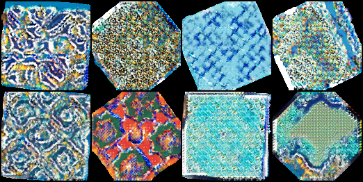
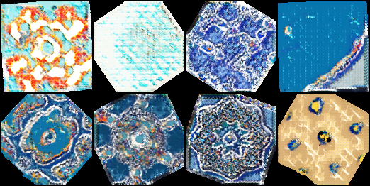
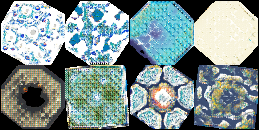

# Islamic Art Generation with DeepVAE + Attention GAN

 
## Overview

This project is a journey into generating high-quality Islamic art using deep learning. We combine a **Deep Convolutional Variational Autoencoder (VAE)** with a **Self-Attention GAN** to capture the intricate patterns and textures of Islamic art.
The current outputs, while capturing structure and pattern, are still somewhat weak in texture and detail. The next design will address these limitations. 

The Model is a combination between :

1. VAE: Learns a compressed representation of Islamic art images and reconstructs them.
2. Attention GAN: Refines the VAE outputs to enhance visual fidelity, texture, and realism.

Along the way, we leverage perceptual loss (VGG16 features), VAE reconstruction loss, and adversarial training to produce the final masterpieces.

* Dataset: [Islamic Art Dataset by Adham El Arabawy](https://huggingface.co/datasets/adhamelarabawy/islamic_art)
* Image Size: 128×128
* Latent Dimension: 256
* Training Epochs: 2500
* Batch Size: 12

---

## The Journey Through Model Design

### 1. DeepVAE (Encoder-Decoder)

**Purpose:** Compress input images into a latent vector and reconstruct them.

**Encoder:**

* 4 convolutional layers (`Conv2d`) + ReLU
* Downsamples 128×128 → 8×8 feature maps
* Flattened output connected to two fully connected layers producing:

  * μ (mean) → latent vector
  * log σ² (log-variance) → latent distribution

**Decoder:**

* Fully connected layer maps latent vector → 512×8×8
* 4 transposed convolution layers (`ConvTranspose2d`) + ReLU
* Output normalized with Tanh to [-1, 1]

**Diagram:**

```
Input 128x128x3
     │
  Conv2d x4 + ReLU
     │
 Flatten
     │
   μ & logσ²
     │
 Reparameterize z
     │
  FC → 512x8x8
     │
 ConvTranspose2d x4 + ReLU/Tanh
     │
Output 128x128x3
```

---

### 2. Attention Generator

**Purpose:** Refines VAE outputs to produce realistic images.

* Encoder-decoder architecture with self-attention after intermediate features.
* Captures global dependencies, crucial for Islamic geometric patterns.
* Uses `ConvTranspose2d` for upsampling.
* Output normalized with **Tanh**.

**Diagram:**

```
VAE Output 128x128x3
     │
 Conv2d x2 + ReLU
     │
 Self-Attention
     │
 ConvTranspose2d x2 + ReLU/Tanh
     │
Generated Image 128x128x3
```

---

### 3. Patch Discriminator (PatchGAN)

**Purpose:** Enforces local realism

* 2 Conv2d layers + LeakyReLU
* Self-attention layer
* Final Conv2d layer → patch-level outputs
* Each output predicts real/fake for local areas of the image.

**Diagram:**

```
Input 128x128x3
     │
 Conv2d x2 + LeakyReLU
     │
 Self-Attention
     │
 Conv2d → PatchGAN output
```

---

## Loss Functions

### VAE Loss

```math
\text{VAE Loss} = \text{MSE} + 0.1 \times \text{Perceptual Loss} + 1e^{-4} \times \text{KL Divergence}
```

* MSE: Pixel-level reconstruction
* Perceptual Loss: Measures similarity in VGG16 feature space
* KL Divergence: Ensures latent vectors follow Gaussian distribution

### GAN Loss (Hinge)

**Discriminator:**

```math
\text{Loss}_D = \text{mean}(\text{relu}(1-D_\text{real})) + \text{mean}(\text{relu}(1+D_\text{fake}))
```

**Generator:**

```math
\text{Loss}_G = -\text{mean}(D_\text{fake})
```

---

 **Training Loop**

* Train VAE → reconstruct images
* Train Discriminator → real vs. generated
* Train Generator → fool discriminator
* Save intermediate images every 5 epochs 

---


### Generated Images

Sharp geometric patterns and vivid textures:




**Observation:**

* Early epochs: blurry outputs
* Later epochs: sharp, detailed patterns
* Self-attention captures long-range dependencies


---

## Dependencies

* Python 3.8+
* PyTorch 2.x
* torchvision
* datasets (Hugging Face)
* tqdm
* PIL
---

## Future Work / Improvements

* Multi-scale discriminators for higher-resolution outputs
* Mixed-precision (AMP) training for speed and efficiency
* Latent space interpolation for smooth art morphing
* Conditional generation (color palette, motif type)

---

## References

* [Islamic Art Dataset](https://huggingface.co/datasets/adhamelarabawy/islamic_art)
* [Self-Attention GAN (SAGAN)](https://arxiv.org/abs/1805.08318)
* [Variational Autoencoder (VAE)](https://arxiv.org/abs/1312.6114)
